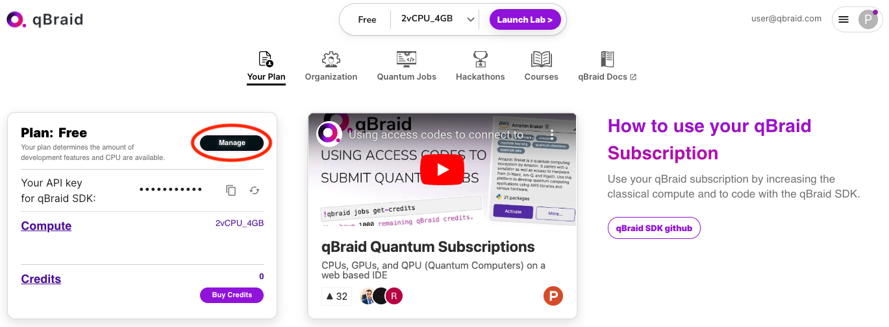
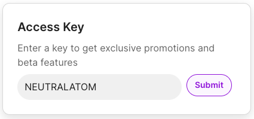
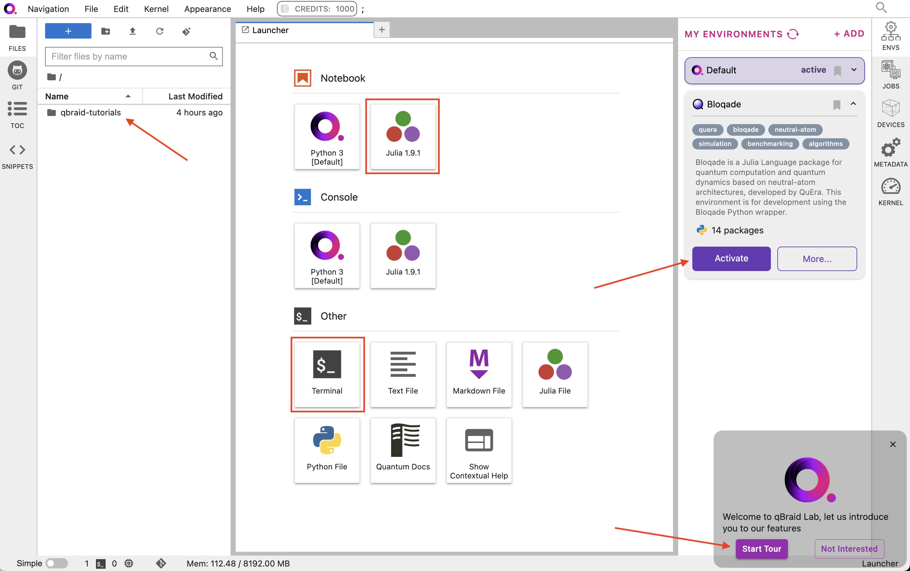

# Using Bloqade with qBraid Lab

Bloqade is available working out-of-the-box through qBraid Lab.
[qBraid](https://www.qbraid.com/) supports Google login, is free-to-use, and requires little to no setup.

## qBraid Bloqade Jupyter Lab Image

Built on top of Ubuntu Server 20.04 LTS, this image includes
- The latest version of Julia and Bloqade
- [Yao.jl](https://yaoquantum.org/)
- [Revise.jl](https://github.com/timholy/Revise.jl)
- [BenchmarkTools.jl](https://juliaci.github.io/BenchmarkTools.jl/stable/)
- [PythonCall.jl](https://cjdoris.github.io/PythonCall.jl/stable/)
- Conda package manager, provided by [Mamba](https://mamba.readthedocs.io/en/latest/index.html)
- Jupyter Lab interface with dedicated Julia and Python kernels
- Integrated Terminal for interactive command-line sessions

See [qBraid system info](https://docs.qbraid.com/en/latest/lab/system.html) for more.

### Step 0: Redeem Access Key

Login to [account.qbraid.com](https://account.qbraid.com/). On the left side of your dashboard, inside the **Plan** card, click **Manage**.



Scroll down to find the card marked **Access Key**. Enter code `NEUTRALATOM` and click **Submit**. This will grant you access to the Bloqade Lab image as well as a number of other premium features.




### Step 1: Select Image & Launch Lab

At the top of your account page, open the image drop down. Select the option named `Bloqade_2vCPU_4GB`, and then click **Launch Lab**. Pulling the Bloqade image may take 2-3 minutes the first time. The next time you launch Lab, it will load much more quickly.


### Step 2: Develop with Notebooks or from Command-Line

Once qBraid Lab is loaded, you are all set! No further setup is required. In the middle of your screen you can click the **Julia 1.9** kernel to open a new Jupyter Notebook configured with the Julia executable. Alternatively, you can click to open **Terminal** and run an interactive `julia` session from the command-line. In this qBraid Lab image, Bloqade is pre-installed and pre-compiled, so you should be able to get started `using Bloqade` right away.




#### Julia Configuration

In qBraid Lab, the `JULIA_DEPOT_PATH` is set to `/opt/.julia`. This default setting means that any additional Julia packages installed will be stored at the system level, and therefore *will not persist between sessions*. To persist additional packages, caches, configs, and other Julia updates, they must be saved at the user level (e.g. `/home/jovyan/.julia`). This can be done by updating the depot path:

```bash
export JULIA_DEPOT_PATH="/foo/bar:$JULIA_DEPOT_PATH"
```

See [Julia environment variables](https://docs.julialang.org/en/v1/manual/environment-variables/#JULIA_DEPOT_PATH) for more.


### Step 3: Explore More Features

The Environment Manager, located in the right sidebar of qBraid Lab, provides a graphical user interface for creating and managing Python virtual environments. This particular Lab image comes with a pre-installed Bloqade Python Wrapper environment. Clicking **Activate** will create a corresponding IPykernel, and allow you to run Jupyter Notebooks using the `bloqade` Python package.

In the bottom right corner qBraid Lab, click **Start Tour** for an interactive walkthrough. You can re-start the tour and access other useful links from the **Help** drop-down in the top menu bar. To stop and/or restart your session, click **File** > **Hub Control Panel** > **Stop My Server**. For more on qBraid environments, kernels, notebooks, and other features or troubleshooting, see [qBraid Lab Docs](https://docs.qbraid.com/en/latest/index.html).
